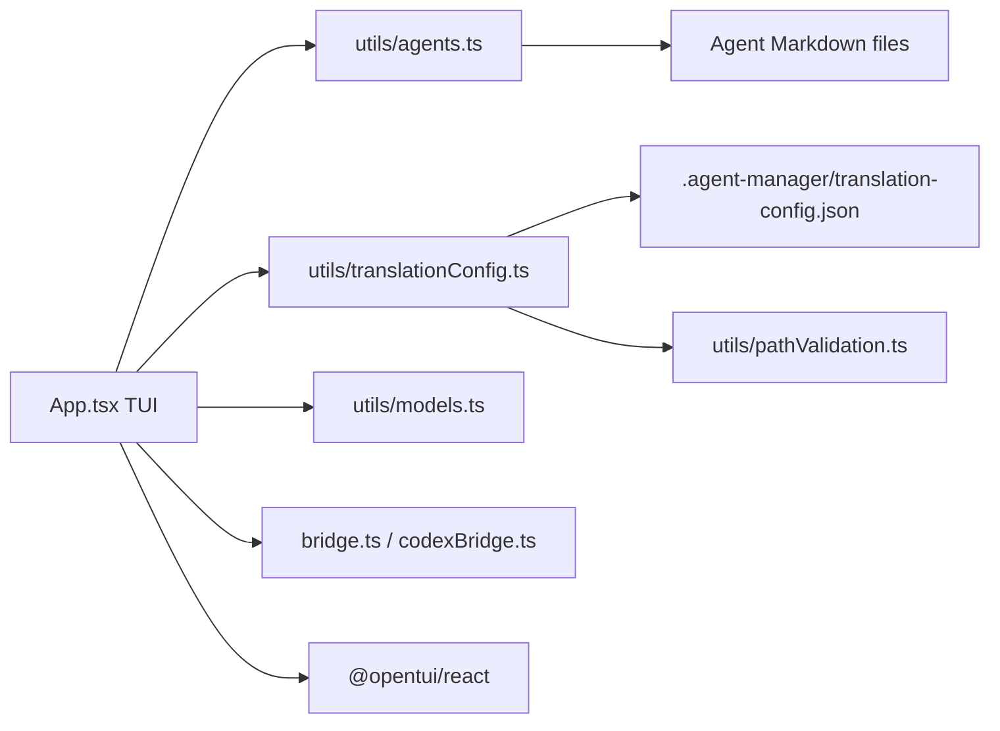

# Agent Manager

## Purpose

`manage-agents` is a React/OpenTUI terminal UI for discovering [agent Markdown files](./pipeline-catalogs.md), selecting agents, inspecting their metadata, and applying model or tier changes. The UI also exposes related agent operations such as category organization, permissions, delegations, parameter tuning, import/export, and bridge generation.

On startup, `App` loads `.agent-manager/translation-config.json` through the [translation-config utility](../config/translation-config.md), discovers agents under the configured `sourceDir` (defaulting to `general`), and loads the available model list. Agent discovery parses frontmatter and computes dynamic category assignments from filename prefixes.

## Key Files

| File | Role |
|------|------|
| `manage-agents/src/App.tsx` | Owns TUI state, views, keyboard handling, rendering, and update actions. |
| `manage-agents/src/utils/translationConfig.ts` | Defines [translation tiers and roles](../config/translation-config.md), validates configuration, and resolves a target model with provenance. |
| `manage-agents/src/utils/agents.ts` | Finds and parses [agent files](./pipeline-catalogs.md) and persists frontmatter updates, including batch model changes. |
| `README.md` | Documents the repository layout, platform-specific startup commands, and the user-facing tier/role workflow. |

## TUI Selection and Update Flow

The main view can be a flat list or a category tree. `TAB` switches views; `↑/↓` or `j/k` moves focus; `SPACE` toggles the focused agent; `A` selects the current flat/tree scope; and `/` starts filename filtering. In the focused tree view, `h/l` or `←/→` collapses and expands categories. `S` toggles agents sharing the focused agent's model (within its category in tree view, or across the list in flat view).

### Model selection

- `M` opens **Select LLM Model** when an agent is focused. The update targets all selected agents, or the focused agent when there is no selection.
- Models are rendered as a provider tree. The provider is the segment before `/`; models without a provider are grouped under `other`.
- `↑/↓` or `j/k` navigates, `PageUp/PageDown` moves by a viewport, `h/l` or `←/→` collapses or expands a provider, and `ENTER` expands a provider or applies the focused model.
- Applying a model calls `updateAgentsModel`, writes the `model` frontmatter field for each target file, refreshes the agent list, clears the selection, and reports the result. `ESC` cancels.

### Tier selection

- `Shift+T` opens **Assign Tier** when an agent is focused. The target set is the selected agents, or the focused agent if none are selected.
- The modal lists the keys in [`translationConfig.tiers`](../config/translation-config.md), showing each tier's Claude model, Codex model, and focused-tier description. `↑/↓` or `j/k` selects a tier; `PageUp/PageDown` pages through the list; `ENTER` assigns it; `ESC` cancels.
- Assignment updates `translationConfig.roles`, not each agent's `model` frontmatter. The updated configuration is validated and saved, then reloaded before the UI refreshes.

## Role-Based Tier Assignment

`resolveRole` derives a [role](../config/translation-config.md) from an agent filename by removing `.md`, removing the configured prefix when present, and lowercasing the result. The tier action resolves every target agent to a role, assigns the chosen tier to each distinct role, and leaves the agent files themselves unchanged.

Because a role can resolve from more than one filename, the action computes non-selected agents with the same resolved roles. The result dialog reports the modified roles and either lists the affected filenames under **Shared-role impact on non-selected agents** or states that no non-selected agents share those roles.

## Tier and Model Display

`App` builds an [inference index](../config/translation-config.md) and resolves each agent for the `claude` target. The main flat/tree list displays the resolved tier and the agent's stored model basename (the final segment after `/`); the inspector shows the stored model in full. The tier modal displays the current tier together with its resolution source, using values such as `planning (role)` or `execution (inferred)`. For multiple targets it reports all distinct `tier (source)` states.

`resolveModelTarget` reports these provenance values:

| Source | Resolution rule |
|--------|------------------|
| `override` | A target-specific override exists for the normalized agent name. |
| `role` | The normalized role maps to an existing configured tier. |
| `inferred` | No role is mapped, inference is enabled, and the stored model uniquely identifies a tier by full or bare model name. |
| `default` | Role resolution is unavailable, inference is disabled/ambiguous, or no unique model match exists; the configured `defaultTier` is used, falling back to the first tier if necessary. |

The inference index uses the stored `frontmatter.model` (or parsed agent model), indexes both the lowercased full model and its provider-free basename, and records the tier matches. A match is used only when exactly one tier matches; ambiguous matches abstain. When inference succeeds, `resolveModelTarget` also returns the original model string as `inferredFrom`.

## Public API

- `App({ workspaceRoot })` — root TUI component.
- `findAgentFiles(workspaceRoot, sourceDir)` — discovers and parses agent Markdown files.
- `updateAgentsModel(agents, model)` — batch-writes a model to agent frontmatter.
- `resolveRole(agent, config)` — derives the normalized role used by tier assignment.
- `buildInferenceIndex(agents, config)` and `resolveModelTarget(agent, index, config, target)` — build model evidence and resolve tier/model targets with provenance.
- `loadTranslationConfig(workspaceRoot)` and `saveTranslationConfig(workspaceRoot, config)` — read and persist the workspace [translation configuration](../config/translation-config.md).

## Platform Startup

From the monorepo root, macOS and Linux use the executable Bash launcher, which prefers Bun and falls back to Node.js:

```bash
./manage-agents.sh
```

On Windows, use Windows Terminal with PowerShell 7 and invoke the `.mjs` launcher directly because the root launcher is a Bash script:

```powershell
bun .\manage-agents\manage-agents.mjs
```

Bun `>= 1.2.0` is recommended because OpenTUI uses FFI. Node.js `>= 26.1.0` is supported as a fallback; the launcher re-executes Node with `--experimental-ffi` when needed. Install dependencies once from `manage-agents/` with `bun install`, or use `npm ci` when running the Node.js fallback.

## Dependencies



- Internal: agent discovery/update utilities, translation configuration and path validation, model loading, and bridge generators.
- External: `@opentui/react`, Node.js filesystem/path/OS/crypto APIs, and the `yaml` package used by the file utilities.

## Usage Example

The tier action identifies roles, finds non-selected agents with shared roles, updates the role map, and persists the configuration:

```ts
const roles: Set<string> = new Set(targetAgents.map(agent => resolveRole(agent, translationConfig)))
const impacted = agents.filter(agent =>
  !targetAgents.some(target => target.currentPath === agent.currentPath) &&
  roles.has(resolveRole(agent, translationConfig))
)
const nextConfig = { ...translationConfig, roles: { ...translationConfig.roles } }
roles.forEach(role => { nextConfig.roles[role] = chosenTier })
saveTranslationConfig(workspaceRoot, nextConfig)
```
