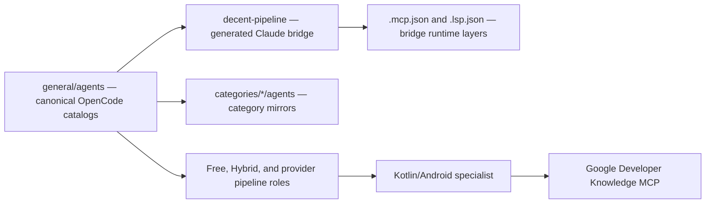

# Pipeline Agent Catalogs

## Purpose

The repository's canonical OpenCode [agent definitions](./agent-manager.md) live in `general/agents/`. The catalog is organized as parallel pipeline families whose filenames encode both the pipeline and the role, for example `free-pipeline-orchestrator.md` or `hybrid-pipeline-kotlin_specialist.md`. Category directories contain generated or organized mirrors of those definitions, while `bridges/claude-code/decent-pipeline/` contains a generated Claude Code [translation layer](../config/translation-config.md).

This page documents the catalog boundaries, shared role surface, pipeline composition, specialist role, mirrors, and bridge packaging. It intentionally consolidates generated variants instead of creating one wiki page per agent file.

## Key Files

| File or path | Role |
|------|------|
| `README.md` | Describes `general/agents/` as the agent-definition directory and shows how to reference it from OpenCode configuration. |
| `general/agents/free-pipeline-*.md` | Canonical Free-pipeline role catalog. |
| `general/agents/hybrid-pipeline-*.md` | Canonical Hybrid-pipeline role catalog. |
| `general/agents/*-pipeline-kotlin_specialist.md` | Kotlin/Android specialist variants for the pipeline families. |
| `categories/*/agents/` | Category-organized copies of agent definitions, including the Free, Hybrid, Copilot, Go, and Kimi pipeline sets. |
| `categories/kimi-pipeline/agents.zip` | Packaged ZIP artifact accompanying the generated Kimi category copy. |
| `bridges/claude-code/decent-pipeline/README.md` | Setup, runtime-layer, naming, and launch information for the generated Claude bridge. |

## Catalog Layout

`general/agents/` is the OpenCode source catalog identified by the repository README. It contains five parallel pipeline families: `free-pipeline-*`, `hybrid-pipeline-*`, `copilot-pipeline-*`, `go-pipeline-*`, and `kimi-pipeline-*`. Each family uses the same broad role vocabulary, while the frontmatter selects the [model](../config/translation-config.md) and permissions for that variant.

| Catalog family | Canonical location | Current role/model characteristic |
|---|---|---|
| Free | `general/agents/free-pipeline-*.md` | Uses the `opencode-go/ox-alpha-free` model in the representative role files and exposes the full coordinator, core-lane, specialist, review, and checkpoint surface. |
| Hybrid | `general/agents/hybrid-pipeline-*.md` | Provides a parallel catalog with Hybrid-specific model assignments, including `hybrid-for-coding/k3` for the orchestrator and `hybrid-for-coding/k3-256k` for planning/reasoning roles. |
| Copilot | `general/agents/copilot-pipeline-*.md` | Provides the Copilot-named pipeline roles; the Kotlin specialist declares `github-copilot/gpt-5.6-luna`. |
| Go | `general/agents/go-pipeline-*.md` | Provides the Go-named pipeline roles; the Kotlin specialist declares `opencode-go/deepseek-v4-flash`. |
| Kimi | `general/agents/kimi-pipeline-*.md` | Provides the Kimi-named pipeline roles; the Kotlin specialist declares `kimi-for-coding/kimi-for-coding`. |

The shared role surface is intentionally catalog-level rather than file-level:

- **Coordination**: `orchestrator` assesses, routes, delegates, evaluates, and conditionally checkpoints work.
- **Discovery and decisions**: `explorer`, `researcher`, `planner`, and `reasoner` provide repository context, research, plans, and deeper analysis.
- **Execution and quality**: `executor`, `tester`, `refactorer`, `code_reviewer`, `critic`, and `post_session` cover implementation, verification, review, final validation, and git-only checkpoint/final commits.
- **Modifiers and specialist roles**: `fast_lane`, `frontend_specialist`, `chrome_devtools`, `multimodal`, `docs_grounding`, `security_auditor`, `swift_specialist`, `kotlin_specialist`, and `hitl` add task-specific checks or pipeline controls.

## Pipeline Composition

The Free and Hybrid orchestrators define the same five core lanes:

| Lane | Agent sequence |
|---|---|
| Fast | `fast_lane` for tiny, obvious, low-risk edits. |
| Standard | `explorer → planner → executor → code_reviewer`. |
| Hard Reasoning | `explorer → planner → reasoner → executor → tester → code_reviewer → critic`. |
| Refactor | `explorer → planner → refactorer → tester → code_reviewer`. |
| Research | `explorer → researcher`. |

The orchestrators assess **Size**, **Risk**, **Clarity**, and **Type** before choosing a lane. Modifiers are then inserted when relevant: frontend and Swift specialists run before planning and after execution; the Kotlin specialist follows the same pre-planning/post-execution pattern for Android work; documentation grounding runs before planning; security review follows code review; and HITL is the final technical checkpoint before `post_session`.

The post-session agent performs only git inspection, staging, and committing. Its source description explicitly excludes wiki and codebase-memory updates, so catalog documentation remains separate from pipeline checkpoint commits.

## Kotlin/Android Specialist Role

Every pipeline family has a Kotlin/Android specialist definition. The role is analysis-only: it validates plans and code and does not edit files. Its documented evidence source is the Google Developer Knowledge MCP, which the specialist uses to ground Android, Jetpack, and API claims rather than relying on assumed API knowledge.

The specialist's scope includes:

- identifying target form factors, SDK levels, Jetpack/AndroidX libraries, deprecated APIs, and coroutine usage;
- checking Android and Jetpack API correctness through targeted documentation searches and selective retrieval;
- reviewing Compose state/lifecycle practices, UI/domain/data separation, AndroidX usage, and deprecated-API replacements;
- checking version compatibility and behavior-sensitive areas such as permissions, background execution, process death, and predictive back; and
- auditing coroutine, `Flow`, structured-concurrency, cancellation, and dispatcher usage when present.

The current orchestrator wiring is explicit in the Free and Hybrid catalogs: their task allowlists include the Kotlin specialist, their assessment type includes `android`, and their Android modifier invokes the specialist before planning and after execution. The Copilot, Go, and Kimi specialist files are present, and their category mirrors are present, but the representative Copilot, Go, and Kimi orchestrator definitions read here do not include a Kotlin specialist in their task allowlists or an Android modifier entry. The catalog therefore treats file presence and orchestrator wiring as separate facts.

## Category Mirrors and Generated Artifacts

The pipeline category directories mirror the canonical role sets under:

- `categories/free-pipeline/agents/`
- `categories/hybrid-pipeline/agents/`
- `categories/copilot-pipeline/agents/`
- `categories/go-pipeline/agents/`
- `categories/kimi-pipeline/agents/`

Representative mirrored orchestrator and Kotlin files add a category frontmatter field such as `category: free-pipeline` or `category: hybrid-pipeline` while retaining the corresponding pipeline role content. Other category catalogs also exist for `general`, `docs`, `slides`, and `wiki`; they group their own agent definitions under the same `categories/<name>/agents/` convention.

`categories/kimi-pipeline/agents.zip` is a generated packaging artifact beside the Kimi mirror. It belongs to the consolidated catalog inventory and should not be treated as a second semantic role catalog or expanded into per-file documentation.

## Generated Claude Bridge

`bridges/claude-code/decent-pipeline/` is a Claude Code plugin generated by OpenCode Bridge. It is a derived [translation layer](../config/translation-config.md), not an alternative source of truth for the OpenCode catalogs. The README documents three generated runtime behaviors:

- `.mcp.json` mirrors enabled OpenCode MCP declarations and adds servers explicitly required by translated agents;
- `.lsp.json` mirrors enabled OpenCode LSP declarations; and
- agent-to-agent references are rewritten to Claude's canonical lowercase-hyphen names.

The bridge README uses names such as `go-pipeline-orchestrator`, `go-pipeline-kotlin-specialist`, and `go-pipeline-fast-lane`, and launches the plugin-qualified orchestrator as `decent-pipeline:go-pipeline-orchestrator`. This naming is the bridge's translation convention; canonical OpenCode filenames use the repository's underscore form for roles such as `kotlin_specialist` and `code_reviewer`.

The documented setup model is:

- `npx`-based servers are fetched on first use and require Node.js, npm, and network access;
- binary servers such as `codebase-memory-mcp` and `cupertino` must already be available on `PATH`;
- the `magic` server requires `TWENTYFIRST_API_KEY`; and
- after setup, Claude Code's `/mcp` command verifies that required servers are connected.

## Dependencies



- Internal: pipeline role definitions, category mirrors, the Kimi ZIP artifact, and the generated Claude bridge.
- External: OpenCode's configured MCP/LSP services; the Kotlin specialist specifically documents Google Developer Knowledge MCP, while the bridge README lists Chrome DevTools, codebase memory, shadcn, magic, Cupertino, Axiom, and CWE Search setup requirements.

## Usage Example

The bridge README documents validation and direct orchestrator launch as follows:

```bash
claude plugin validate ./bridges/claude-code/decent-pipeline --strict
claude --plugin-dir ./bridges/claude-code/decent-pipeline
claude --plugin-dir ./bridges/claude-code/decent-pipeline --agent decent-pipeline:go-pipeline-orchestrator
```
